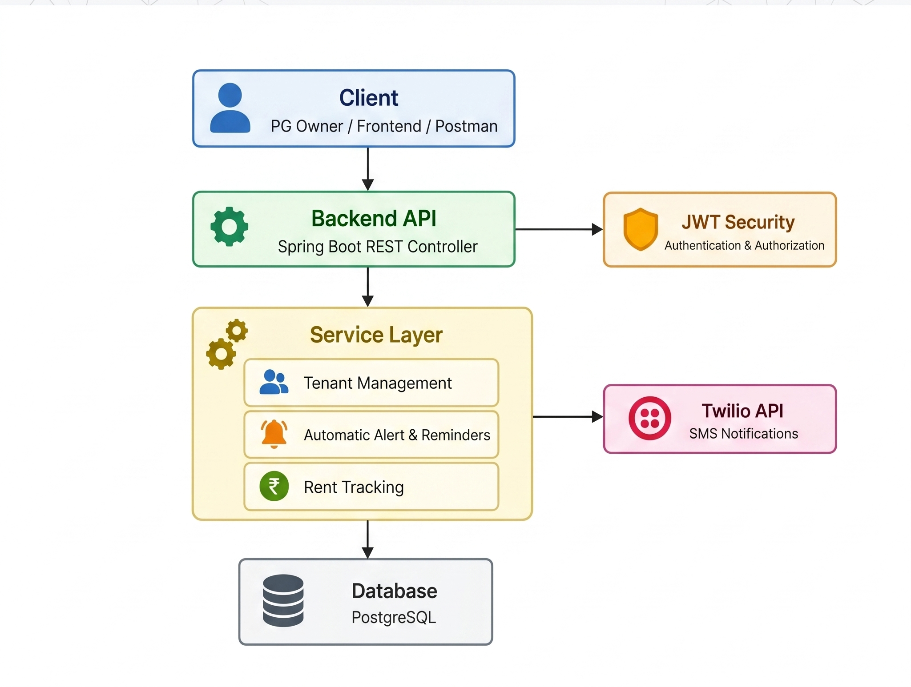

_# 🏠 PG Management System
### Smart PG operations, automated end-to-end for modern accommodation owners.

[](https://www.oracle.com/java/)
[](https://spring.io/projects/spring-boot)
[](https://www.twilio.com/)
[](https://www.postgresql.org/)
[](https://www.mysql.com/)

**PG Management System** is a full-featured backend-driven web application built to automate the day-to-day workflow of Paying Guest (PG) accommodation management. It helps PG owners handle tenant onboarding, room allocation, rent tracking, payment reminders, and due-date alerts through a secure Spring Boot REST API with real Twilio integration.

## Problem Statement
Managing a PG manually is operationally exhausting.

Traditional PG operations often depend on notebooks, spreadsheets, phone calls, and memory-based follow-ups. That creates real business problems:

- Missed rent reminders and delayed collections
- Difficulty tracking tenants, room occupancy, and payment status
- Repetitive manual communication with every tenant
- No centralized system for search, updates, or owner-level visibility
- High dependency on human effort for tasks that should be automated

This project solves that by turning PG management into a structured, API-first system where tenant records, rent workflows, and reminder communication are automated and traceable.

## Features
- 👤 Tenant registration with owner-linked account isolation
- 🛏️ Room and tenant management through customer records
- 💸 Rent status tracking with `PAID` and `PENDING` workflows
- ⏰ Automated due-date alerts before rent deadlines
- 📩 Custom SMS reminders sent to tenants using Twilio API
- 🔍 Search, pagination, sorting, and filtered tenant retrieval
- ✏️ Full update and partial update support for tenant records
- 🔐 JWT-based authentication and secured APIs for PG owners
- 📊 Owner-focused dashboard-ready backend APIs

## System Architecture
### Architecture

<div align="center">
  
</div>

### Request Flow
1. A PG owner registers or logs in and receives a JWT token.
2. Authenticated requests hit secured REST endpoints.
3. Business logic processes tenant actions such as add, update, search, due-check, or alert generation.
4. Tenant and payment data is stored in the relational database.
5. When reminder conditions are met, Twilio sends automated SMS notifications to tenants.

## Tech Stack
- **Java 21**
- **Spring Boot**
- **Spring MVC**
- **Spring Data JPA**
- **PostgreSQL / MySQL**
- **Spring Security + JWT**
- **Twilio API**
- **Maven**
- **Postman**
- **MapStruct + Lombok**

## Twilio Integration
This project includes live Twilio-powered messaging to reduce manual follow-up work for PG owners.

### How automated reminders work
- Tenant data is stored with join date, phone number, and fee status.
- The service checks whether a tenant is nearing the expected rent cycle or has rent pending.
- Eligible tenants are filtered in the service layer.
- A personalized reminder message is generated.
- Twilio sends the SMS directly to the tenant's registered phone number.

### Automation Value
- Reduces missed reminders
- Improves rent collection discipline
- Removes repetitive manual calling or texting
- Demonstrates real third-party API integration in a production-style backend

## Installation & Setup
### Prerequisites
- Java 21
- Maven
- PostgreSQL or MySQL
- Twilio account with Account SID, Auth Token, and sender number

### 1. Clone the repository
```bash
git clone https://github.com/your-username/pg-management-system.git
cd pg-management-system
```

### 2. Configure database and secrets
Update `src/main/resources/application.properties` with your own values:

```properties
spring.datasource.url=jdbc:postgresql://localhost:5432/customer_db
spring.datasource.username=your_db_username
spring.datasource.password=your_db_password
spring.jpa.hibernate.ddl-auto=update

media.twilio.account-sid=your_twilio_account_sid
media.twilio.auth-token=your_twilio_auth_token

jwt.secret=your_secure_jwt_secret
```

If you want to use MySQL instead of PostgreSQL, update the JDBC URL, username/password, and add the MySQL driver dependency.

### 3. Build the project
```bash
./mvnw clean install
```

On Windows:

```powershell
.\mvnw.cmd clean install
```

### 4. Run the application
```bash
./mvnw spring-boot:run
```

On Windows:

```powershell
.\mvnw.cmd spring-boot:run
```

### 5. Test the APIs
Use Postman or any REST client and start with:
- `POST /api/register`
- `POST /api/login`

Then pass the JWT token in the `Authorization` header:

```http
Authorization: Bearer <your_token>
```

## Testing
This project includes unit tests for the controller and service layers, which helps validate business logic, authentication-related behavior, exception handling, and Twilio integration flow.

### Current test coverage includes
- `CustomerServiceTest` for tenant lifecycle operations, alerts, search, patch/update flows, and payment status logic
- `MyUserDetailServiceTest` for username lookup, user ID lookup, registration, and failure scenarios
- `UserServiceTest` for registration and login verification behavior
- `TwilioServiceTest` for messaging-related service behavior
- `CustomerControllerTest` and `UserControllerTest` for REST endpoint validation
- `GlobalExceptionHandlerTest` for exception response behavior
- `JwtServiceTest` and `RepositoryCheckServiceTest` for supporting backend service validation

### Run tests
```bash
./mvnw test
```

On Windows:

```powershell
.\mvnw.cmd test
```

## API Endpoints Overview
| Method | Endpoint | Description | Auth |
|---|---|---|---|
| `POST` | `/api/register` | Register a new PG owner/admin user | No |
| `POST` | `/api/login` | Authenticate user and return JWT token | No |
| `POST` | `/api/customers` | Add a new tenant/customer record | Yes |
| `PUT` | `/api/customers/{id}` | Fully update tenant details | Yes |
| `PATCH` | `/api/customers/{id}` | Partially update tenant details | Yes |
| `GET` | `/api/customers/{id}` | Fetch tenant details by ID | Yes |
| `GET` | `/api/customers` | List tenants with pagination and sorting | Yes |
| `GET` | `/api/customers/search` | Search tenants by keyword | Yes |
| `DELETE` | `/api/customers/{id}` | Delete a tenant record | Yes |
| `POST` | `/api/customers/{id}/sms` | Send a custom SMS reminder to a tenant | Yes |
| `GET` | `/api/alert/{days}` | Send reminder alerts before due date | Yes |
| `POST` | `/api/customers/alert` | Send alerts to selected pending tenants | Yes |
| `GET` | `/api/customers/rent-pending` | Mark due tenants as pending and return them | Yes |

## What This Project Demonstrates
- A backend solution built around a real-world business problem, not just a basic CRUD use case
- REST API design using Java and Spring Boot
- Authentication and authorization using Spring Security and JWT
- Clean backend architecture with controller, service, repository, DTO, and mapper layers
- Third-party service integration through Twilio for communication workflows
- Automation of repetitive operational tasks to improve efficiency
- Relational database design and persistence using PostgreSQL/MySQL and Spring Data JPA
- Production-oriented backend thinking around maintainability, testability, and secure user-level data handling

## Conclusion
This project is more than a basic CRUD backend. It is a structured Spring Boot application that combines secure API design, clean backend architecture, database integration, and automated communication workflows to solve a practical PG management problem in a clear and maintainable way._

